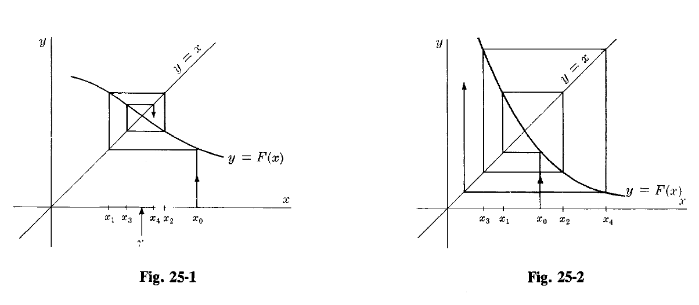
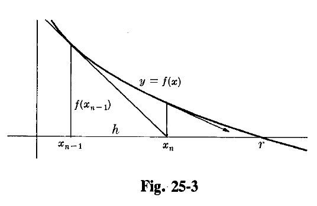

# Roots of Equations

The problem treated in this chapter is the ancient problem of finding roots of equations or of systems of equations. The long list of available methods shows the long history of this problem and its continuing importance.

Which method to use depends upon whether one needs all the roots of a particular equation or only a few, whether the roots are real or complex, simple or multiple, whether one has a ready first approximation or not, and so on.

## The iterative method

The **iterative method** solves $x = F(x)$ by the recursion

$$
x_n = F(x_{n-1})
$$

and converges to a root if $|F'(x)| \leq L < 1$. The error $e_n = r - x_n$, where $r$ is the exact root, has the property

$$
e_n \simeq F'(r) e_{n-1}
$$

so that each iteration reduces the error by a factor near $F'(r)$. If $F'(r)$ is near 1 this is slow convergence.

### Solved Problems

#### Problem 25.1

 > Prove that if $r$ is a root of $f(x) = 0$ and if this equation is rewritten in the form $x = F(x)$ in such a way that $|F'(x)| \leq L < 1$ in an interval $I$ centered at $x = r$, then the sequence $x_n = F(x_{n-1})$ with $x_0$ arbitrary but in the interval $I$ has $\lim x_n = r$.

First we find

$$
|F(x) - F(y)| = |F'(\xi)(x - y)| \leq L |x - y|
$$

provided both $x$ and $y$ are close to $r$. Actually it is this Lipschitz condition rather than the more restrictive condition on $F'(x)$ which we need. Now

$$
|x_n - r| = |F(x_{n-1}) - F(r)| \leq L |x_{n-1} - r|
$$

so that, since $L < 1$, each approximation is at least as good as its predecessor. This guarantees that all our approximations are in the interval $I$, so that nothing interrupts the algorithm. Applying the last inequality $n$ times, we have

$$
|x_n - r| \leq L^n |x_0 - r|
$$

and since $L < 1$, $\lim x_n = r$.

The convergence is illustrated in Fig. 25-1. Note that choosing $F(x_{n-1})$ as the next $x_n$ amounts to following one of the horizontal line segments over to the line $y = x$. Notice also that in Fig. 25-2 the case $|F'(x)| > 1$ leads to divergence.

#### Problem 25.2

> In the year 1225 Leonardo of Pisa studied the equation
> $$
> f(x) = x^3 + 2x^2 + 10x - 20 = 0
> $$
>and produced $x = 1.368808107$. Nobody knows by what method Leonardo found this value but it is a remarkable result for his time. Apply the method of Problem 25.1 to obtain this result.

The equation can be put into the form $x = F(x)$ in many ways. We take $x = F(x) = \frac{20}{x^2 + 2x + 10}$, which suggests the iteration

$$
x_n = \frac{20}{x_{n-1}^2 + 2x_{n-1} + 10}
$$

With $x_0 = 1$ we find $x_1 = \frac{20}{13} \approx 1.538461538$. Continuing the iteration produces the sequence of Table 25.1. Sure enough, on the twenty-fourth round Leonardo’s value appears.

##### Table 25.1

| n  | $x_n$       | n  | $x_n$       |
|----|------------------|----|------------------|
| 1  | 1.538461538      | 13 | 1.368817874      |
| 2  | 1.295019157      | 14 | 1.368803773      |
| 3  | 1.401825309      | 15 | 1.368810031      |
| 4  | 1.354209390      | 16 | 1.368807254      |
| 5  | 1.375298092      | 17 | 1.368808486      |
| 6  | 1.365929788      | 18 | 1.368807940      |
| 7  | 1.370086003      | 19 | 1.368808181      |
| 8  | 1.368241023      | 20 | 1.368808075      |
| 9  | 1.369059812      | 21 | 1.368808122      |
| 10 | 1.368696397      | 22 | 1.368808101      |
| 11 | 1.368857688      | 23 | 1.368808110      |
| 12 | 1.368786102      | 24 | 1.368808107      |

#### Problem 25.3 

> Why is the convergence of the algorithm of the previous problem so slow?

The rate of convergence may be estimated from the relation

$$
e_n = r - x_n = F(r) - F(x_{n-1}) = F'(\xi)(r - x_{n-1}) = F'(\xi) e_{n-1}
$$

which compares the $n$ - th error $e_n$ with the preceding error. As $n$ increases we may take $F'(r)$ as an approximation to $F'(\xi)$, assuming the existence of this derivative. Then $e_n \simeq F'(r) e_{n-1}$. In our example,

$$
F'(r) = -\frac{40(r + 1)}{(r^2 + 2r + 10)^2} \approx -0.44
$$

making each error about $-0.44$ times the one before it. This suggests that two or three iterations will be required for each new correct decimal place, and this is what the algorithm has actually achieved.

---

The $\Delta^2$ **process can accelerate convergence** under some circumstances. It consists of the approximation

$$
r \simeq x_{n+2} - \frac{(\Delta x_{n+1})^2}{\Delta^2 x_n}
$$

which may be derived from the error property given above.

---

#### Problem 25.4 

> Apply the idea of extrapolation to the limit to accelerate the previous algorithm.

This idea may be used whenever information about the character of the error in an algorithm is available. Here we have the approximation $e_n \simeq F'(r) e_{n-1}$. Without knowledge of $F'(r)$ we may still write

$$
r - x_{n+1} \simeq F'(r)(r - x_n)
$$

$$
r - x_{n+2} \simeq F'(r)(r - x_{n+1})
$$

Dividing we find

$$
\frac{r - x_{n+1}}{r - x_{n+2}} \simeq \frac{r - x_n}{r - x_{n+1}}
$$

and solving for the root

$$
r \simeq x_{n+2} - \frac{(x_{n+2} - x_{n+1})^2}{x_{n+2} - 2x_{n+1} + x_n}
= x_{n+2} - \frac{(\Delta x_{n+1})^2}{\Delta^2 x_n}
$$

This is often called the **Aitken $\Delta^2$ process**.

#### Problem 25.5

> Apply extrapolation to the limit to the computation of Problem 25.2.

Using $x_{10}$, $x_{11}$, and $x_{12}$, the formula produces

$$
r \simeq 1.368786102 - \frac{(0.000071586)^2}{-0.000232877} \simeq 1.368808107
$$

which is once again Leonardo’s value. With this extrapolation, only half the iterations are needed. Using it earlier might have made still further economies by stimulating the convergence.

#### Problem 25.6

> Using extrapolation to the limit systematically after each three iterations is what is known as **Steffensen’s method**. Apply this to Leonardo’s equation.

The first three approximations $x_0$, $x_1$, and $x_2$ may be borrowed from Problem 25.2. Aitken’s formula is now used to produce $x_3$:

$$
x_3 = x_2 - \frac{(x_2 - x_1)^2}{x_2 - 2x_1 + x_0} = 1.370813882
$$

The original iteration is now resumed as in Problem 25.2 to produce $x_4$ and $x_5$:

$$
x_4 = F(x_3) = 1.367918090 \quad \quad x_5 = F(x_4) = 1.369203162
$$

Aitken’s formula then yields $x_6$:

$$
x_6 = x_5 - \frac{(x_5 - x_4)^2}{x_5 - 2x_4 + x_3} = 1.368808169
$$

The next cycle brings the iterates

$$
x_7 = 1.368808080 \quad x_8 = 1.368808120
$$

from which Aitken’s formula manages $x_9 = 1.368808108$.

#### Problem 25.7

> Show that other rearrangements of Leonardo’s equation may not produce convergent sequences.

As an example we may take $x = \frac{20 - 2x^2 - x^3}{10}$, which suggests the iteration

$$
x_n = \frac{20 - 2x_{n-1}^2 - x_{n-1}^3}{10}
$$

Again starting with $x_0 = 1$, we are led to the sequence:

$$
x_1 \simeq 1.70 \quad x_2 \simeq 0.93 \quad x_3 \simeq 1.75 \quad x_4 \simeq 0.85
$$

$$
x_5 \simeq 1.79 \quad x_6 \simeq 0.79 \quad x_7 \simeq 1.83 \quad x_8 \simeq 0.72
$$

and so on. It seems clear that alternate approximations are headed in opposite directions. Comparing with Problem 25.1 we find that here

$$
F'(r) = \frac{-4r - 3r^2}{10} < -1
$$

confirming the computational evidence.

## The Newton Method

The **Newton method** obtains successive approximations

$$
x_n = x_{n-1} - \frac{f(x_{n-1})}{f'(x_{n-1})}
$$

to a root of $f(x) = 0$ and is unquestionably a very popular algorithm. If $f'(x)$ is complicated, the previous iterative method may be preferable, but Newton’s method converges much more rapidly and usually gets the nod. The error $e_n$ here satisfies

$$
e_n \simeq -\frac{f''(r)}{2f'(r)} e_{n-1}^2
$$

This is known as **quadratic convergence**, each error roughly proportional to the square of the previous error. The number of correct digits almost doubles with each iteration.

The square root iteration

$$
x_n = \frac{1}{2} \left( x_{n-1} + \frac{Q}{x_{n-1}} \right)
$$

is a special case of Newton’s method, corresponding to $f(x) = x^2 - Q$. It converges quadratically to the positive square root of $Q$, for $Q > 0$.

The more general root-finding formula

$$
x_n = x_{n-1} - \frac{x_{n-1}^p - Q}{p x_{n-1}^{p-1}}
$$

is also a special case of Newton’s method. It produces a $p$-th root of $Q$.

### Solved Problems

#### Problem 25.8
 
> Derive the Newton iterative formula $x_n = x_{n-1} - \frac{f(x_{n-1})}{f'(x_{n-1})}$ for solving $f(r) = 0$.

Beginning with Taylor’s formula

$$
f(r) = f(x_{n-1}) + (r - x_{n-1}) f'(x_{n-1}) + \frac{1}{2} (r - x_{n-1})^2 f''(\xi)
$$

we retain the linear part, recall that $f(r) = 0$, and define $x_n$ by putting it in place of the remaining $r$ to obtain

$$
0 = f(x_{n-1}) + (x_n - x_{n-1}) f'(x_{n-1})
$$

which rearranges at once into

$$
r \simeq x_n = x_{n-1} - \frac{f(x_{n-1})}{f'(x_{n-1})}
$$

#### Problem 25.9

> What is the geometric interpretation of Newton’s formula?

It amounts to using the tangent line to $y = f(x)$ at $x_{n-1}$ in place of the curve. In Fig. 25-3 it can be seen that this leads to

$$
\frac{f(x_{n-1}) - 0}{x_{n-1} - x_n} = f'(x_{n-1})
$$

which is once again Newton’s formula. Similar steps follow, as suggested by the arrow.

#### Problem 25.10

> Apply Newton’s formula to Leonardo’s equation.

With $f(x) = x^3 + 2x^2 + 10x - 20$, we find $f'(x) = 3x^2 + 4x + 10$, and the iterative formula becomes

$$
x_n = x_{n-1} - \frac{x_{n-1}^3 + 2x_{n-1}^2 + 10x_{n-1} - 20}{3x_{n-1}^2 + 4x_{n-1} + 10}
$$

Once more choosing $x_0 = 1$, we obtain the results in Table 25.2.

##### Table 25.2

| $n$ | 1          | 2          | 3           | 4           |
|--------|------------|------------|-------------|-------------|
| $x_n$ | 1.411764706 | 1.369336471 | 1.368808189 | 1.368808108 |

The speed of convergence is remarkable. In four iterations we have essentially Leonardo’s value. In fact, computation shows that

$$
f(1.368808107) \simeq -0.000000016
$$
$$
f(1.368808108) \simeq -0.000000005
$$

which suggests that the Newton result is the winner by a nose.
